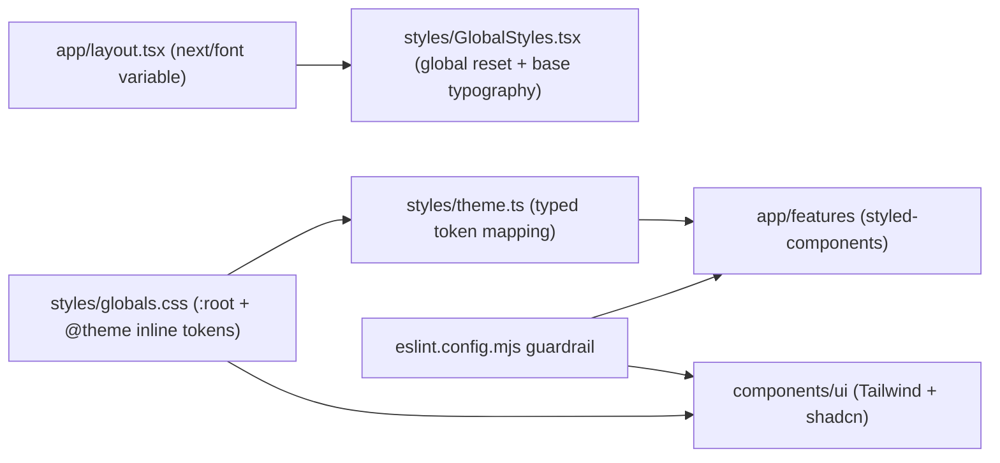

# Web Styling Strategy

## TL;DR

- `styled-components` is the primary styling system for app and feature code.
- Tailwind exists to support shadcn primitives in `apps/web/components/ui`.
- CSS variables in `apps/web/styles/globals.css` are the shared token source.
- `apps/web/styles/theme.ts` maps those tokens into typed `styled-components` theme values.

## Architecture

## Ownership Boundaries

- **Primary styling path**
  - Use `styled-components` + `theme` in app/features.
  - Use `theme.space.*` aliases first.
  - Use `theme.spaceCalc(n)` / `theme.spaceCalcNeg(n)` only for fine-tuning.
- **Tailwind scope**
  - Allowed for shadcn UI primitives in `apps/web/components/ui`.
  - Allowed in `apps/web/styles/globals.css` for token/utility compatibility.
  - Not the default styling path for feature modules.
- **Global style ownership**
  - `apps/web/styles/GlobalStyles.tsx`: reset, base element behavior, typography defaults.
  - `apps/web/styles/globals.css`: token declarations and Tailwind interop utilities.
  - `apps/web/app/layout.tsx`: font loading and font variable wiring (`next/font`).

## Dual-Theme Model (Why It Exists)

- Dual-theme means:
  - Tailwind consumers (`components/ui`) and styled-components consumers share the same design tokens.
  - Both systems resolve from CSS variables, so values stay in sync.
- This model exists to keep shadcn components Tailwind-compatible while using `styled-components` as the main app styling system.

## Enforcement

- Guardrail lives in `apps/web/eslint.config.mjs`.
- Outside `components/ui/**` and `styles/**`, importing `cn` from `@/lib/utils` is restricted (`no-restricted-imports`).
- Current enforcement level is warning-level (`warn`) and used as a boundary signal during setup.

## Cascade & Layer Constraint

- Tailwind v4 emits all styles inside CSS `@layer`s (`base`, `components`, `utilities`).
- **Unlayered CSS always beats `@layer` styles**, regardless of specificity or source order.
- `styled-components` injects styles without any `@layer`, so any universal selector (`*`) in `GlobalStyles.tsx` would override Tailwind utility classes like `p-4`, `m-auto`, etc.
- **Rule**: never put `margin`, `padding`, `box-sizing`, `border-color`, or `outline-color` resets on `*` in `GlobalStyles.tsx`. Tailwind preflight already handles `box-sizing` / `margin` / `padding`. The `border-color` and `outline-color` defaults live in `globals.css` inside `@layer base`.

## Desktop-First Contract

- Styled-components breakpoints are desktop-first:
  - `theme.media.belowTablet` (`max-width: 1023px`)
  - `theme.media.belowMobile` (`max-width: 767px`)
- In `components/ui` Tailwind usage, responsive overrides follow desktop-first semantics (`max-*` variants) when needed.
