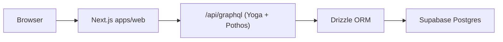

# ApplyMate architecture

## Runtime components

- `apps/web`: Next.js app (UI + server routes)
- `/api/graphql`: GraphQL Yoga endpoint inside `apps/web`
- Pothos code-first schema in `apps/web/app/api/graphql/schema`
- Drizzle data layer in `apps/web/lib/db`
- Supabase Postgres as the single persistence backend

## Request flow

## Auth and context

- NextAuth keeps JWT-based sessions.
- GraphQL context resolves user from either:
  - NextAuth session cookies, or
  - signed Bearer token (used by server-side GraphQL client).
- Public operation: `plans`.
- Protected operations: user and experience queries/mutations.

## Database ownership model

- SQL migrations in `supabase/migrations/*.sql` are the source of truth.
- Drizzle schema in `apps/web/lib/db/schema/*` must mirror migration changes.
- Postgres enums are modeled via `pgEnum()` and kept in sync with migration values.

## Deployment model (Vercel Hobby)

- Single deployable service: `apps/web`.
- No long-running gateway/microservice processes.
- API route functions are serverless-friendly.
- Upload subscription architecture is replaced by request/response-friendly flows
  (polling or Supabase-native realtime where needed).
