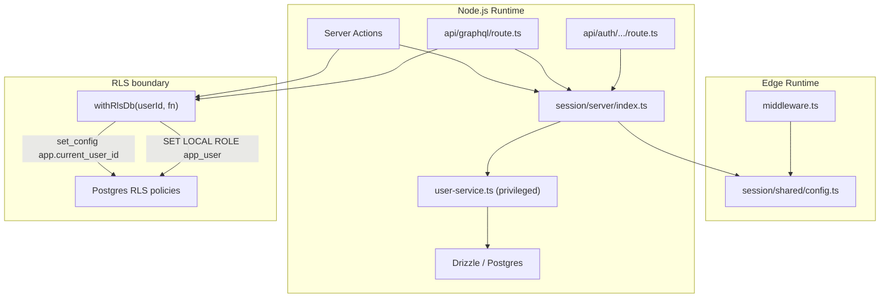

# Auth / session / permissions

## Architecture overview

**Identity** is handled by NextAuth (JWT sessions). **Authorization**
for user-owned data is enforced by Postgres Row Level Security (RLS)
via the `withRlsDb()` helper. The two systems are connected by a
single value: `session.user.id` (the database UUID).

Auth is split into two files for Edge/Node.js runtime compatibility:

- `apps/web/modules/session/shared/config.ts` — **edge-safe** config
  shared with middleware. Contains providers, the `authorized` callback,
  session strategy, and redirect logic. No database or Node.js-only
  imports.
- `apps/web/modules/session/server/index.ts` — **Node.js-only**
  (`'server-only'`). Spreads the edge-safe config and adds `jwt` and
  `session` callbacks that require database access (user upsert via
  Drizzle).

## Session model

- NextAuth uses **JWT sessions** (`strategy: 'jwt'`).
- On initial sign-in the `jwt` callback upserts the user into the
  `users` table and stores the database UUID as `token.dbUserId`.
- The `session` callback exposes the database UUID as `session.user.id`.
- `getSession()` in `modules/session/server/index.ts` is a React
  `cache()` wrapper around `auth()` for safe use in Server Components.

## Middleware (Edge)

- `apps/web/middleware.ts` imports only `authConfig` (edge-safe).
- The matcher limits middleware to `/dashboard/*`, `/settings/*`,
  `/profile/*`.
- The `authorized` callback returns `!!auth`; NextAuth automatically
  redirects unauthenticated users to `/auth`.

## Route and API protection

| Layer             | Mechanism                                             |
| ----------------- | ----------------------------------------------------- |
| Protected pages   | Middleware matcher + `authorized` callback            |
| Server Components | `getSession()` check before data access               |
| Server Actions    | `auth()` check + `withRlsDb()` for DB operations      |
| GraphQL API       | Per-resolver `context.user` check + `withRlsDb()`     |
| Auth endpoints    | `/api/auth/*` — handled by NextAuth, public by design |

## GraphQL auth model

- Endpoint: `POST /api/graphql`.
- `createGraphqlContext` resolves the user via NextAuth session cookies
  (`auth()`).
- Context sets `user: null` when unauthenticated; resolvers decide
  whether to allow or reject.
- All user-scoped resolvers wrap service calls in `withRlsDb()`.

| Operation           | Auth required | RLS enforced |
| ------------------- | ------------- | ------------ |
| `health`            | No            | No           |
| `plans`             | No            | No (public)  |
| `currentUser`       | Yes           | Yes          |
| `user(id)`          | Yes           | Yes          |
| `experienceProfile` | Yes           | Yes          |
| `saveExperience`    | Yes           | Yes          |
| `upsertRole`        | Yes           | Yes          |

## User upsert flow

- The `jwt` callback in `session/server/index.ts` calls
  `upsertUserFromOAuth` directly on initial sign-in.
- This is a **privileged path**: it uses the shared `db` client
  (superuser connection that bypasses RLS) because no session exists
  yet at sign-in time.
- No GraphQL mutation is involved; the upsert is a server-side DB call
  only.
- If the upsert or email validation fails, the error propagates and
  the sign-in is aborted (no silent fallback).

## Data access and RLS

### How it works

1. The app connects to Postgres with server-side credentials from
   `DATABASE_URL` (Supabase Supavisor pooler, transaction mode).
2. For **user-scoped operations**, entry points (resolvers, server
   actions) call `withRlsDb(session.user.id, fn)` which opens a
   transaction and runs:
   - `SET LOCAL ROLE app_user` — downgrades to a restricted role that
     is subject to RLS.
   - `SELECT set_config('app.current_user_id', $userId, true)` — sets
     a transaction-local GUC read by RLS policies.
3. All queries inside the callback run as `app_user` with RLS policies
   enforcing ownership: `current_setting('app.current_user_id')::uuid`.
4. When the transaction ends the connection returns to its original
   (superuser) role.

### Allowed exception paths

- **All public queries bypass RLS.** They do not set
  `app.current_user_id`, so they run outside the user-scoped RLS
  boundary. `lib/db/services/plan-service.ts` is one example of this
  pattern.
- The ESLint `no-restricted-imports` rule blocks `@/lib/db/client`
  imports across app code.
- The only global ignores are:
  - `lib/db/client.ts` because it defines the shared client.
  - `lib/db/rls.ts` because it wraps that shared client with
    `SET LOCAL ROLE app_user` and `app.current_user_id`.
- Any other privileged or public use of `@/lib/db/client` must stay
  localized with an inline ESLint suppression at the call site.

### RLS policy summary

| Table                           | Policy                                   |
| ------------------------------- | ---------------------------------------- |
| `users`                         | Own row: `id = current_user_id`          |
| `user_experience_profiles`      | Own profile: `user_id = current_user_id` |
| `user_experience_roles`         | Via profile ownership                    |
| `user_experience_role_projects` | Via role → profile ownership             |
| `user_experience_learning`      | Via profile ownership                    |
| `plans`                         | Public read (`USING (true)`)             |
