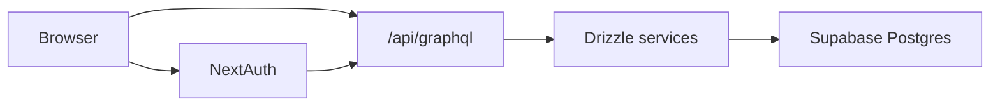

# Auth / session / permissions

## Session model

- NextAuth uses JWT sessions in `apps/web/lib/auth`.
- Protected UI routes rely on `auth()` in middleware.
- Session user id is the canonical DB UUID from the `users` table.

## GraphQL auth model

- API endpoint: `POST /api/graphql`.
- Request context tries auth in this order:
  1. Bearer token signed with `AUTH_SECRET`.
  2. NextAuth session cookies.
- Public query: `plans`.
- Protected operations: `user`, `currentUser`, `experienceProfile`,
  `saveExperience`.

## Upsert flow for OAuth sign-in

- NextAuth callback calls `apps/web/lib/db/services/user-service.ts`
  directly (`upsertUserFromOAuth`).
- No internal GraphQL roundtrip from auth callbacks.
- GraphQL `upsertUser` resolver reuses the same shared service function.

## Data access and RLS

- App writes/reads with server-side DB credentials from `DATABASE_URL`.
- Supabase migrations keep RLS on and encode policy defaults.
- App layer enforces user scoping for protected resolvers.

## Flow diagram

