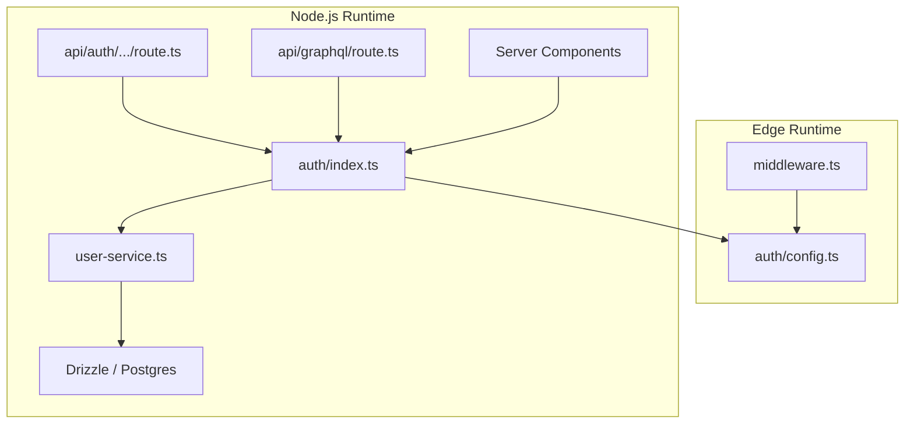

# Auth / session / permissions

## Architecture overview

Auth is split into two files for Edge/Node.js runtime compatibility:

- `apps/web/lib/auth/config.ts` — **edge-safe** config shared with
  middleware. Contains providers, the `authorized` callback, session
  strategy, and redirect logic. No database or Node.js-only imports.
- `apps/web/lib/auth/index.ts` — **Node.js-only** (`'server-only'`).
  Spreads the edge-safe config and adds `jwt` and `session` callbacks
  that require database access (user upsert via Drizzle).

## Session model

- NextAuth uses **JWT sessions** (`strategy: 'jwt'`).
- On initial sign-in the `jwt` callback upserts the user into the
  `users` table and stores the database UUID as `token.dbUserId`.
- The `session` callback exposes the database UUID as `session.user.id`.
- `getSession()` in `apps/web/lib/auth/index.ts` is a React `cache()`
  wrapper around `auth()` for safe use in Server Components.

## Middleware (Edge)

- `apps/web/middleware.ts` imports only `authConfig` (edge-safe).
- The matcher limits middleware to `/dashboard/*`, `/settings/*`,
  `/profile/*`.
- The `authorized` callback returns `!!auth`; NextAuth automatically
  redirects unauthenticated users to `/auth`.

## Route and API protection

| Layer | Mechanism |
|---|---|
| Protected pages | Middleware matcher + `authorized` callback |
| Server Components | `getSession()` check before data access |
| Server Actions | `getSession()` check at the top of the action |
| GraphQL API | Per-resolver `context.user` check (see below) |
| Auth endpoints | `/api/auth/*` — handled by NextAuth, public by design |

## GraphQL auth model

- Endpoint: `POST /api/graphql`.
- `createGraphqlContext` resolves the user in order:
  1. Bearer JWT verified with `AUTH_SECRET` (via `jose`).
  2. NextAuth session cookies (via `auth()`).
- Context sets `user: null` when unauthenticated; resolvers decide
  whether to allow or reject.

| Operation | Auth required |
|---|---|
| `health` | No |
| `plans` | No |
| `currentUser` | Yes (returns `null` if unauthenticated) |
| `user(id)` | Yes + ownership check (`user.id === args.id`) |
| `experienceProfile` | Yes |
| `saveExperience` | Yes |

## User upsert flow

- The `jwt` callback in `auth/index.ts` calls `upsertUserFromOAuth`
  directly on initial sign-in.
- No GraphQL mutation is involved; the upsert is a server-side DB call
  only.
- If the upsert or email validation fails, the error propagates and
  the sign-in is aborted (no silent fallback).

## Data access and RLS

- The app connects to Postgres with server-side credentials from
  `DATABASE_URL` (Supabase Supavisor pooler, transaction mode).
- Drizzle uses a service role connection that bypasses RLS.
- Supabase migrations enable RLS on all tables with "deny all for anon"
  policies as defense-in-depth.
- User-scoping is enforced at the application layer: GraphQL resolvers
  use `context.user.id`, Server Components use `getSession()`.
