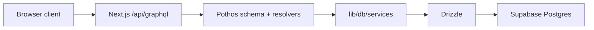

# Web GraphQL architecture

The web app now owns its GraphQL API surface directly in `apps/web`.

## Current design

- Endpoint: `/api/graphql`
- Runtime: Next.js route handlers (Node runtime)
- Server stack: GraphQL Yoga + Pothos (code-first)
- Data layer: Drizzle ORM + `postgres.js`
- Frontend types: GraphQL Codegen from generated
  `apps/web/graphql/schema.graphql`

## Request flow

## Why this replaced Mesh + microservices

- Single deployable unit fits Vercel Hobby constraints.
- Lower cold-start and operational cost.
- Simpler auth and data flow (no internal gateway hops).
- Keeps typed frontend GraphQL workflows through codegen.
